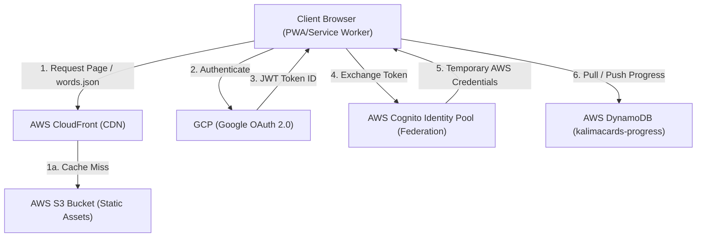

# System Architecture & Cost Estimation Specification

This document provides a detailed overview of the system architecture for **KalimaCards**, including its integration across GCP (Google Cloud Platform) and AWS (Amazon Web Services), and a comprehensive cost estimation for scaling to **100,000 Monthly Active Users (MAU)**.

---

## 1. System Architecture Diagram



---

## 2. Component Directory & Tech Stack

### A. Client Side (PWA)
* **Single Page Application (SPA):** Static HTML, Vanilla CSS, and modular Vanilla JS (`app.js`, `auth.js`, `sync.js`).
* **Service Worker (`sw.js`):** Offline capabilities, aggressive local caching of static assets and [`words.json`](file:///Users/tareqmy/development/javascriptprojects/kalimacards/words.json) (1.38 MB file containing lexical dataset).
* **LocalStorage:** Stores client-side application state including user theme preferences, persistent stats (known, learning, seen words), starred items, and filter settings.

### B. Hosting (AWS)
* **AWS S3:** Serves as the origin server for static assets (HTML, CSS, JS, manifest, fonts, and database JSON files).
* **AWS CloudFront:** Provides edge caching globally (and specifically in `ap-south-1` for optimal performance in the Indian subcontinent/Mumbai regions), reducing latency and egress bandwidth costs.

### C. Authentication (GCP + AWS)
* **Google Cloud Console (GCP):** Google OAuth 2.0 Client credentials authorize users and hand down a verified JSON Web Token (JWT).
* **AWS Cognito Identity Pools (Federated Identities):** Exclusively handles token exchange. It verifies the Google JWT signature and returns temporary IAM role credentials granting restricted, direct database read/write access to the user's DynamoDB keyspace.

### D. Database (AWS)
* **AWS DynamoDB:** A schema-less database storing user progression. 
* **Table Name:** `kalimacards-progress`
* **Partition Key:** `userId` (derived from Cognito Identity ID).
* **Record Structure:**
  ```json
  {
    "userId": "ap-south-1:2a3def15-xxxx-xxxx-xxxx-xxxxxxxxxxxx",
    "stats": {
      "known": ["transliteration1", "transliteration2"],
      "learning": ["transliteration3"],
      "seen": ["transliteration1", "transliteration2", "transliteration3"]
    },
    "starredWords": ["arabic_transliteration1"],
    "lastSyncedAt": "2026-07-13T12:00:00.000Z",
    "schemaVersion": 1
  }
  ```

---

## 3. Data Sync & Traffic Characteristics

To minimize database transaction costs, the synchronization logic in [`sync.js`](file:///Users/tareqmy/development/javascriptprojects/kalimacards/sync.js) uses client-side buffering:
* **Debounced Writes:** Changes to user stats are debounced by **300 seconds (5 minutes)** before triggering a cloud sync. During active studying, intermediate writes are postponed.
* **Exit-Flush Saves:** If a user closes the window or tab, a final sync is flushed immediately using the window `visibilitychange` listener.
* **Payload Hash Matching:** The client tracks the last successfully written payload. If the local state is identical to the cloud (e.g. no changes, or no new edits after an initial sync), the network write is completely skipped.
* **Reads:** Progress is pulled exactly **once** upon application start or user log-in.

---

## 4. Cost Projection (100,000 Active Users)

### Metrics & Scaling Parameters
* **Monthly Active Users (MAU):** 100,000.
* **Monthly Sessions:** 1,500,000 sessions (avg. 15 sessions per active user).
* **Network Caching efficiency:** 90% (due to PWA offline caching). Only 10% of sessions require downloading `words.json` and static assets.
* **Sync Updates (Writes):** Avg. 1.01 writes/session (due to 300s debounce and payload matching) $\rightarrow$ 1,515,000 writes/month.
* **Pulls (Reads):** 1 pull/session $\rightarrow$ 1,500,000 reads/month.
* **Storage Requirement:** 100,000 users $\times$ 2 KB average payload $\approx$ **200 MB** total storage.

### Cost Details (ap-south-1 Mumbai Region Pricing)

> [!NOTE]
> The table below assumes AWS Free Tier limits where applicable. The first year of standard AWS Free Tier is factored into the "Free Tier" column.

| Infrastructure Component | Monthly Volume | Cost (Within Free Tier) | Cost (Pay-As-You-Go / Out of Free Tier) | Details & Calculation |
| :--- | :--- | :---: | :---: | :--- |
| **AWS CloudFront** | 210 GB Data Transfer Out | **$0.00** | **$0.00** | CloudFront provides 1 TB free data transfer out per month permanently. |
| **AWS S3** | 2 MB File storage | **$0.00** | **$0.05** | Storage cost is negligible ($0.023/GB). |
| **GCP Google Auth** | 100,000 Logins | **$0.00** | **$0.00** | OAuth authentication endpoints are free. |
| **AWS Cognito Identity Pools** | 1.5M credential exchanges | **$0.00** | **$0.00** | Cognito Federated Identity Pools is a free utility. |
| **AWS DynamoDB (Storage)** | 200 MB Storage | **$0.00** | **$0.06** | AWS Free tier covers 25 GB free forever. Out of free tier: $0.285/GB. |
| **AWS DynamoDB (Reads)** | 1.5M reads (Eventually Consistent) | **$0.00** | **$0.21** | 1.5M reads $\times$ 0.5 RRU = 750,000 RRUs. Cost: $0.283 per million RRUs. |
| **AWS DynamoDB (Writes)** | 1.515M writes (Average size 2 KB) | **$0.00** | **$4.28** | 1.515M writes $\times$ 2 WRU = 3.03M WRUs. Cost: $1.414 per million WRUs. |
| **Total Estimated Cost** | | **$0.00 / mo** | **~$4.60 / mo** | **Highly optimized serverless structure.** |

---

## 5. Architectural Recommendations for Scale

> [!TIP]
> **1. Configure DynamoDB Provisioned Capacity (Free Forever Database)**
> Instead of using On-Demand pricing ($4.28/mo), provision your table capacity manually:
> * Set **Read Capacity Units (RCU) = 5**
> * Set **Write Capacity Units (WCU) = 15**
> * Enable Auto-Scaling.
>
> Under the AWS Free Tier, you get 25 RCU and 25 WCU **completely free forever** (not just in the first year). Setting up provisioned limits will drop your database cost to $0.00 indefinitely.

> [!IMPORTANT]
> **2. Optimize Service Worker Lifecycle**
> Set HTTP cache-control headers on CloudFront for `words.json` to `public, max-age=31536000, immutable`. Only change the version string/filename query parameters when updating the data model. This enforces local client side caching and keeps egress bandwidth near-zero.
