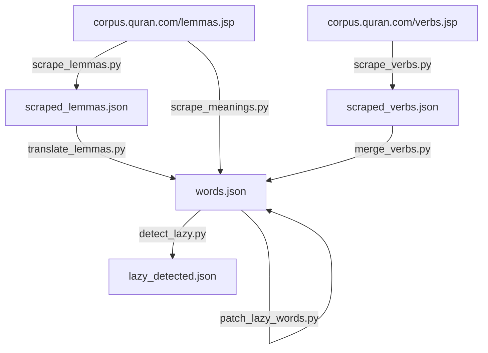

# KalimaCards Developer & Data Pipeline Guide 🛠️

Welcome to the **KalimaCards** Developer and Data Pipeline documentation. This guide explains the internal design, file schemas, data scraping, translation pipeline, and refinement process that powers the application vocabulary database.

---

## 🏗️ Architecture & Data Flow

The vocabulary data is compiled from [corpus.quran.com](https://corpus.quran.com) through a multi-stage Python pipeline. The target output is [words.json](file:///Users/tareqmy/development/javascriptprojects/kalimacards/words.json), which serves as the client-side database for the web application.

Here is how the data pipelines are structured:



---

## 🗂️ Data Pipeline Scripts

All processing scripts are located in the [scripts/](file:///Users/tareqmy/development/javascriptprojects/kalimacards/scripts/) directory.

### 1. Ingestion / Scraping

*   **[scrape_lemmas.py](file:///Users/tareqmy/development/javascriptprojects/kalimacards/scripts/scrape_lemmas.py)**:
    Scrapes all lemma entries (dictionary forms), their frequency, part of speech, and grammar analysis page URLs from the Quranic Corpus.
    *   **Output**: [scraped_lemmas.json](file:///Users/tareqmy/development/javascriptprojects/kalimacards/scraped_lemmas.json)
    *   **Usage**:
        ```bash
        python3 scripts/scrape_lemmas.py json scraped_lemmas.json
        ```

*   **[scrape_verbs.py](file:///Users/tareqmy/development/javascriptprojects/kalimacards/scripts/scrape_verbs.py)**:
    Extracts verbal roots, forms, and occurrences from the corpus, translating Arabic characters into Buckwalter transliteration.
    *   **Output**: [scraped_verbs.json](file:///Users/tareqmy/development/javascriptprojects/kalimacards/scraped_verbs.json)
    *   **Usage**:
        ```bash
        python3 scripts/scrape_verbs.py scraped_verbs.json
        ```

### 2. Translation & Merging

*   **[translate_lemmas.py](file:///Users/tareqmy/development/javascriptprojects/kalimacards/scripts/translate_lemmas.py)**:
    Translates Arabic lemmas into English using Google Translate's API. It operates with batch request handling, strict timeouts, and backoff routines to bypass rate limits.
    *   **Input**: [scraped_lemmas.json](file:///Users/tareqmy/development/javascriptprojects/kalimacards/scraped_lemmas.json)
    *   **Output**: [words.json](file:///Users/tareqmy/development/javascriptprojects/kalimacards/words.json)
    *   **Usage**:
        ```bash
        python3 scripts/translate_lemmas.py [optional_limit_count]
        ```

*   **[merge_verbs.py](file:///Users/tareqmy/development/javascriptprojects/kalimacards/scripts/merge_verbs.py)**:
    Integrates the verbs and root definitions gathered from `scraped_verbs.json` into `words.json`. It matches verbs based on their Arabic and transliterated keys and appends the root parameters.
    *   **Input**: [words.json](file:///Users/tareqmy/development/javascriptprojects/kalimacards/words.json), [scraped_verbs.json](file:///Users/tareqmy/development/javascriptprojects/kalimacards/scraped_verbs.json)
    *   **Output**: [words.json](file:///Users/tareqmy/development/javascriptprojects/kalimacards/words.json)
    *   **Usage**:
        ```bash
        python3 scripts/merge_verbs.py words.json scraped_verbs.json
        ```

*   **[scrape_meanings.py](file:///Users/tareqmy/development/javascriptprojects/kalimacards/scripts/scrape_meanings.py)**:
    Crawls individual lemma URLs listed in `words.json` in parallel to scrape multi-context translations (up to 5 per word) directly from the Corpus study pages.
    *   **Output**: Updates [words.json](file:///Users/tareqmy/development/javascriptprojects/kalimacards/words.json) inline.
    *   **Usage**:
        ```bash
        python3 scripts/scrape_meanings.py
        ```

### 3. Verification & Corrections

*   **[detect_lazy.py](file:///Users/tareqmy/development/javascriptprojects/kalimacards/scripts/detect_lazy.py)**:
    Identifies "lazy" transliteration echos (where translation and transliteration match after vowel stripping), saving them to a review file.
    *   **Output**: `lazy_detected.json` (temporary reference file)
    *   **Usage**:
        ```bash
        python3 scripts/detect_lazy.py
        ```

*   **[patch_words.py](file:///Users/tareqmy/development/javascriptprojects/kalimacards/scripts/patch_words.py)**:
    Applies precise Classical Quranic translations to the top 100 high-frequency lemmas, correcting modern colloquial translations.
    *   **Usage**:
        ```bash
        python3 scripts/patch_words.py
        ```

*   **[patch_lazy_words.py](file:///Users/tareqmy/development/javascriptprojects/kalimacards/scripts/patch_lazy_words.py)**:
    Applies classical definitions to the rest of the vocabulary (over 200+ terms), resolving lazy machine translations and aligning names/places.
    *   **Usage**:
        ```bash
        python3 scripts/patch_lazy_words.py
        ```

*   **[parse_corpus.py](file:///Users/tareqmy/development/javascriptprojects/kalimacards/scripts/parse_corpus.py)**:
    A utility script to parse arbitrary CSV source tables (columns: `Arabic`, `Transliteration`, `Meaning`, `Frequency`) and output them in the standard application format.
    *   **Usage**:
        ```bash
        python3 scripts/parse_corpus.py input_file.csv output_file.json
        ```

---

## 📊 Database JSON Schema

The main dictionary file [words.json](file:///Users/tareqmy/development/javascriptprojects/kalimacards/words.json) contains a sorted JSON list of lemma objects.

### Schema Fields
| Field | Type | Description |
| :--- | :--- | :--- |
| `arabic` | `string` | The Arabic lemma text containing vowel marks (diacritics). |
| `transliteration` | `string` | Buckwalter transliteration of the word form. |
| `meaning` | `string` | Primary translated meaning. |
| `meanings` | `array of strings` | List of secondary contextual translations (up to 5 items). |
| `frequency` | `integer` | Total number of occurrences in the Holy Quran. |
| `part_of_speech` | `string` | Grammatical label (e.g., `Noun`, `Verb`, `Preposition`). |
| `root` | `string` | (Optional) The three or four letter Arabic root of the word. |
| `url` | `string` | Analysis link to [corpus.quran.com](https://corpus.quran.com) for deeper study. |

### Schema Example
```json
[
  {
    "arabic": "قَالَ",
    "transliteration": "qaAla",
    "meaning": "say, speak",
    "meanings": [
      "say",
      "speak",
      "call"
    ],
    "frequency": 1725,
    "part_of_speech": "Verb",
    "root": "قول",
    "url": "https://corpus.quran.com/qurandictionary.jsp?q=qwl"
  }
]
```

---

## 🌐 Local Development & Serving

### Commands Overview
To ease local development, a [Makefile](file:///Users/tareqmy/development/javascriptprojects/kalimacards/Makefile) is provided:

*   **Run Development Server**:
    Starts python built-in server at [http://localhost:8000](http://localhost:8000).
    ```bash
    make run
    ```
    *Specify custom port:* `make run PORT=9000`
*   **Compile CSV to JSON**:
    Converts a custom raw CSV dataset to [words.json](file:///Users/tareqmy/development/javascriptprojects/kalimacards/words.json).
    ```bash
    make parse CSV=path/to/data.csv
    ```

---

## 📱 Progressive Web App (PWA) Configurations

*   **[manifest.json](file:///Users/tareqmy/development/javascriptprojects/kalimacards/manifest.json)**:
    Configures app naming, display modes (`standalone`), background styles, and icons for desktop/mobile installability.
*   **[sw.js](file:///Users/tareqmy/development/javascriptprojects/kalimacards/sw.js)**:
    Handles offline assets caching (`ASSETS_TO_CACHE`) and implements a cache-first network-fallback service policy for high responsiveness.
